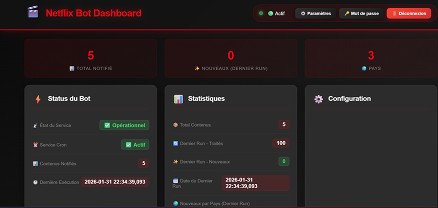
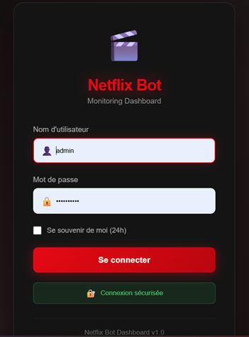
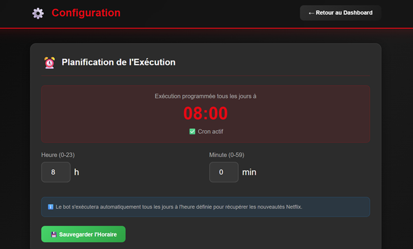

# 🎬 Bouba Discord Netflix Notifier

Un bot Discord en Python déployable via Docker qui vous informe automatiquement des nouveautés Netflix directement sur votre serveur Discord, au jour le jour !

## ✨ Fonctionnalités

### 🤖 Bot Discord
- ✅ **Notifications automatiques** des nouveaux films et séries Netflix
- ✅ **Exécution planifiée** via cron (configurable)
- ✅ **Multi-pays** : surveillez Netflix dans plusieurs régions simultanément
- ✅ **Anti-doublons** : ne notifie jamais deux fois le même contenu
- ✅ **Informations enrichies** via TMDB API (synopsis, note, poster, etc.)
- ✅ **Catégorisation** par genre (Action, Comédie, Documentaire, etc.)

### 🌐 Interface Web Moderne
- ✅ **Dashboard Netflix-style** avec design professionnel
- ✅ **Authentification sécurisée** (mots de passe hashés avec bcrypt)
- ✅ **Monitoring en temps réel** : statistiques, logs, état du cron
- ✅ **Configuration interactive** :
  - Modifier les pays surveillés depuis l'interface
  - Changer l'horaire du cron sans toucher au code
  - Gestion des utilisateurs et des mots de passe
- ✅ **Interface responsive** compatible mobile/tablette/desktop
- ✅ **Logs en direct** avec auto-refresh
- ✅ **Exécution manuelle** du bot en un clic

### 📊 Statistiques Détaillées
- Total de contenus notifiés
- Nouveaux contenus par pays
- Statistiques du dernier run
- Historique des exécutions

## 🎯 Captures d'écran

### Dashboard


### Page de Connexion


### Configuration Interactive


## 🗂️ Architecture du Projet

```
bouba-discord-netflix-notifier/
├── 📁 data/                    # Données persistantes
│   ├── sent_ids.json          # Mémoire anti-doublons
│   └── users.json             # Base de données utilisateurs
├── 📁 logs/                    # Logs du bot
│   ├── cron.log               # Logs des exécutions cron
│   └── netflix_bot_debug.log  # Logs de debug
├── 📁 templates/               # Templates HTML Flask
│   ├── index.html             # Dashboard principal
│   ├── login.html             # Page de connexion
│   └── settings.html          # Page de configuration
├── 🐳 Dockerfile               # Image Docker multi-étapes Alpine
├── 🐳 docker-compose.yml       # Configuration Docker Compose
├── 🐍 netflix_bot.py           # Script principal du bot
├── 🌐 web_interface.py         # Interface web Flask
├── ⏰ crontab.txt              # Configuration du cron
├── 🚀 start.sh                 # Script de démarrage
├── 📦 requirements.txt         # Dépendances Python
└── 📖 README.md               # Documentation
```

## 🐳 Image Docker Légère

Ce projet utilise une **image Docker Alpine ultra-légère** grâce à un build multi-étapes :

| Caractéristique | Détail |
|-----------------|--------|
| **Image de base** | `python:3.11-alpine` |
| **Taille finale** | ~80 Mo (vs ~400 Mo avec Debian) |
| **Build** | Multi-étapes (compilation séparée) |
| **Sécurité** | Utilisateur non-root (UID 1000) |
| **Cron** | `dcron` (léger, adapté Alpine) |

### Avantages de l'image Alpine
- ✅ **5x plus légère** que les images Debian/Ubuntu
- ✅ **Démarrage rapide** du conteneur
- ✅ **Surface d'attaque réduite** (moins de paquets)
- ✅ **Téléchargement et déploiement accélérés**
- ✅ **Consommation mémoire minimale**

## ⚙️ Prérequis

- 🐳 **Docker** installé ([Guide d'installation](https://docs.docker.com/get-docker/))
- 🐳 **Docker Compose** installé
- 🔑 **Token Discord** (Webhook pour les notifications)
- 🔑 **Clé API UNOGS** via [RapidAPI](https://rapidapi.com/unogs/api/unogs)
- 🔑 **Clé API TMDB** via [The Movie Database](https://www.themoviedb.org/settings/api)
- 🌐 **Connexion Internet**

## 🚀 Installation & Lancement

### 1️⃣ Cloner le projet

```bash
git clone https://github.com/bouba89/bouba-discord-netflix-notifier.git
cd bouba-discord-netflix-notifier
```

### 2️⃣ Créer le fichier `.env`

```bash
touch .env
```

Remplissez le fichier `.env` avec vos clés API :

```env
# APIs Netflix & TMDB
RAPIDAPI_KEY=votre_cle_rapidapi_ici
TMDB_API_KEY=votre_cle_tmdb_ici

# Discord Webhook
DISCORD_WEBHOOK=https://discord.com/api/webhooks/votre_webhook_ici

# Pays à surveiller (codes ISO 2 lettres, séparés par des virgules)
COUNTRIES=FR,US,CA,GB,DE,ES,IT,JP

# Clé secrète Flask pour les sessions (générez-en une aléatoire)
FLASK_SECRET_KEY=votre_cle_secrete_super_aleatoire_ici
```

💡 **Générer une clé secrète Flask sécurisée :**
```bash
python3 -c "import secrets; print(secrets.token_hex(32))"
```

### 3️⃣ Construire et lancer le conteneur

```bash
# Build et démarrage
docker-compose up --build -d

# Vérifier que tout fonctionne
docker logs -f bouba_discord_netflix_notifier
```

### 4️⃣ Accéder à l'interface web

Ouvrez votre navigateur : **http://localhost:5000**

**Compte par défaut :**
- 👤 **Username :** `admin`
- 🔒 **Password :** `admin123`

⚠️ **IMPORTANT :** Changez le mot de passe immédiatement après la première connexion !

## 🎮 Utilisation

### Interface Web

1. **Dashboard** (`http://localhost:5000`)
   - Voir les statistiques en temps réel
   - Consulter les logs en direct
   - Exécuter le bot manuellement
   - Télécharger les logs

2. **Paramètres** (`http://localhost:5000/settings`)
   - ⏰ Modifier l'horaire du cron
   - 🌍 Ajouter/retirer des pays
   - 💾 Sauvegarder la configuration

3. **Gestion du compte**
   - 🔑 Changer votre mot de passe
   - 🚪 Se déconnecter

### Commandes Docker

```bash
# Voir les logs en temps réel
docker logs -f bouba_discord_netflix_notifier

# Redémarrer le conteneur
docker-compose restart

# Arrêter le conteneur
docker-compose stop

# Supprimer le conteneur
docker-compose down

# Entrer dans le conteneur
docker exec -it bouba_discord_netflix_notifier bash

# Exécuter le bot manuellement
docker exec -it bouba_discord_netflix_notifier python /app/netflix_bot.py

# Vérifier le cron
docker exec -it bouba_discord_netflix_notifier crontab -l
```

## 🔧 Configuration Avancée

### Modifier l'horaire du cron

**Via l'interface web (recommandé) :**
- Allez sur `http://localhost:5000/settings`
- Modifiez l'heure et les minutes
- Cliquez sur "💾 Sauvegarder l'Horaire"

**Manuellement :**
```bash
# Éditer le crontab
docker exec -it bouba_discord_netflix_notifier nano /app/crontab.txt

# Réinstaller le crontab
docker exec -it bouba_discord_netflix_notifier crontab /app/crontab.txt

# Redémarrer cron
docker exec -it bouba_discord_netflix_notifier service cron restart
```

### Ajouter/Retirer des pays

**Via l'interface web (recommandé) :**
- Allez sur `http://localhost:5000/settings`
- Section "Pays à Surveiller"
- Ajoutez ou retirez des pays
- Cliquez sur "💾 Sauvegarder les Pays"

**Codes pays disponibles :**
- 🇫🇷 FR (France)
- 🇺🇸 US (USA)
- 🇨🇦 CA (Canada)
- 🇬🇧 GB (Royaume-Uni)
- 🇩🇪 DE (Allemagne)
- 🇪🇸 ES (Espagne)
- 🇮🇹 IT (Italie)
- 🇯🇵 JP (Japon)
- 🇧🇷 BR (Brésil)
- Et bien d'autres... (codes ISO 3166-1 alpha-2)

### Réinitialiser la mémoire anti-doublons

Si vous souhaitez que le bot renvoie tous les contenus :

**Via l'interface web :**
- Dashboard → "🗑️ Reset Mémoire"

**Manuellement :**
```bash
docker exec -it bouba_discord_netflix_notifier bash -c "echo '[]' > /app/data/sent_ids.json"
```

## 🔒 Sécurité

### Authentification
- ✅ Mots de passe hashés avec **bcrypt**
- ✅ Sessions sécurisées avec clé secrète Flask
- ✅ Protection de toutes les routes API
- ✅ Timeout de session configurable (24h par défaut)

### Bonnes pratiques
1. **Changez le mot de passe admin** après la première connexion
2. **Définissez une clé secrète Flask forte** dans `.env`
3. **Ne commitez jamais** le fichier `.env` sur GitHub
4. **Limitez l'accès** au port 5000 (pare-feu)
5. **Sauvegardez régulièrement** le dossier `/data`

## 🐛 Dépannage

### Le cron ne s'exécute pas

```bash
# Vérifier que cron tourne
docker exec -it bouba_discord_netflix_notifier service cron status

# Vérifier le crontab
docker exec -it bouba_discord_netflix_notifier crontab -l

# Réinstaller le crontab
docker exec -it bouba_discord_netflix_notifier crontab /app/crontab.txt
docker exec -it bouba_discord_netflix_notifier service cron restart
```

### Erreur "crontab file is missing newline"

Le fichier `crontab.txt` doit se terminer par une ligne vide :

```bash
echo "" >> crontab.txt
docker cp crontab.txt bouba_discord_netflix_notifier:/app/
docker exec -it bouba_discord_netflix_notifier crontab /app/crontab.txt
```

### L'interface web ne fonctionne pas

```bash
# Vérifier que Flask est installé
docker exec -it bouba_discord_netflix_notifier pip list | grep Flask

# Vérifier que les templates existent
docker exec -it bouba_discord_netflix_notifier ls -la /app/templates/

# Redémarrer le conteneur
docker-compose restart
```

### Les notifications Discord ne partent pas

1. Vérifiez que le webhook Discord est correct dans `.env`
2. Testez le webhook manuellement
3. Consultez les logs : `docker logs bouba_discord_netflix_notifier`

## 🔄 Mises à jour

```bash
# Récupérer les dernières modifications
git pull origin main

# Reconstruire l'image
docker-compose down
docker-compose build --no-cache
docker-compose up -d
```

## 🤝 Contribution

Les contributions sont les bienvenues ! 

1. 🍴 Fork le projet
2. 🌿 Créez une branche (`git checkout -b feature/nouvelle-fonctionnalite`)
3. 💾 Commit vos changements (`git commit -m 'Ajout d'une nouvelle fonctionnalité'`)
4. 📤 Push vers la branche (`git push origin feature/nouvelle-fonctionnalite`)
5. 🔀 Ouvrez une Pull Request

### Idées de contributions

- [ ] Support de Telegram/Slack en plus de Discord
- [ ] Filtres par genre/note/année
- [ ] Système de recommandations personnalisées
- [ ] Export des statistiques en CSV/JSON
- [ ] Notifications par email
- [ ] Support multi-utilisateurs avec rôles
- [ ] API REST complète
- [ ] Interface mobile native

## 📄 Licence

Ce projet est sous licence **Open Source**.

## 👨‍💻 Auteur

**Bouba89**
- GitHub: [@bouba89](https://github.com/bouba89)
- Projet: [bouba-discord-netflix-notifier](https://github.com/bouba89/bouba-discord-netflix-notifier)

## 🙏 Remerciements

- [UNOGS API](https://rapidapi.com/unogs/api/unogs) pour les données Netflix
- [TMDB API](https://www.themoviedb.org/) pour les informations détaillées
- [Discord](https://discord.com/) pour l'API de webhooks
- [Flask](https://flask.palletsprojects.com/) pour le framework web
- [Docker](https://www.docker.com/) pour la conteneurisation

## 📞 Support

En cas de problème :
1. 📖 Consultez la section [Dépannage](#-dépannage)
2. 🐛 Ouvrez une [Issue](https://github.com/bouba89/bouba-discord-netflix-notifier/issues)
3. 💬 Consultez les discussions existantes

---

🎬 **Bon monitoring Netflix !** 🍿
